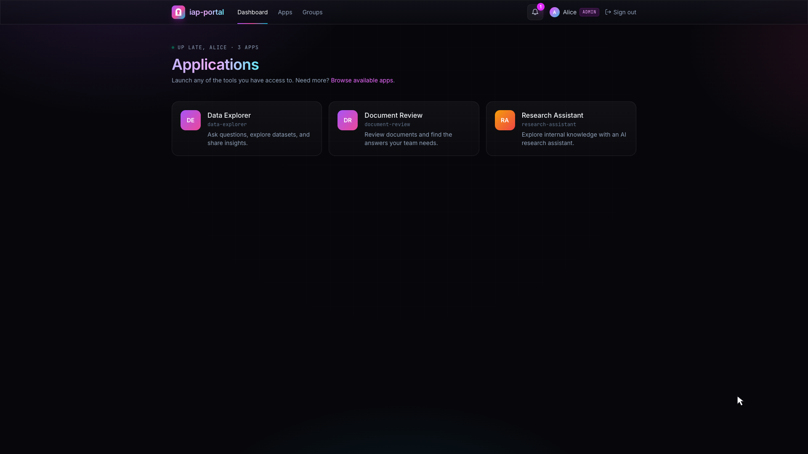
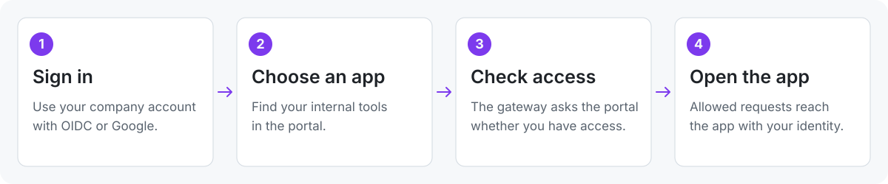

<p align="center">
  <picture>
    <source media="(prefers-color-scheme: dark)" srcset="assets/wordmark-dark.svg">
    
  </picture>
</p>

<h3 align="center">Identity-aware proxy and app portal for internal tools</h3>

<p align="center">
  <a href="https://github.com/dylan-murray/iap-portal/actions/workflows/portal-ci.yml"></a>
  <a href="deploy/platform/README.md"></a>
  <a href="LICENSE"></a>
</p>

<h2></h2>

iap-portal is an open-source **identity-aware proxy (IAP) and app portal**, built
on Kubernetes and Istio. It checks who a user is and whether they can access an
app before forwarding their request.

AI makes it easy to build internal tools. iap-portal gives your team a way to
share them with sign-in and access controls built in. Ship a Streamlit tool, a
Gradio demo, a FastAPI service, or a custom web app. App owners decide who can
use their tools from the portal.



## 💡 Why iap-portal

Getting an internal app running is often easier than sharing it. Every new tool
needs a URL, sign-in, access rules, and somewhere for people to find it. iap-portal
provides those pieces once, so each app can use the same deployment and access model.

- **A home for your tools.** A shared app catalog with owner-managed access
  requests, user and group grants, and expiration.
- **Sign-in at the gateway.** Configure your OIDC provider, Google, or both. Istio checks access
  before forwarding traffic to an app.
- **Ship updates with a git push.** Once an app's deployment workflow is configured,
  CI builds its image, deploys it, and registers it in the portal. An `iap-app.yaml`
  file keeps its route, owners, and runtime settings in code.
- **Built for interactive apps.** WebSockets and streaming work through the
  gateway. The bundled Streamlit and FastAPI apps exercise both.
- **Your infrastructure.** Use your registry, Postgres, domains, and Kubernetes
  Secrets. No required secrets-management vendor or hosted control plane.
- **Your portal name.** Set `portal.displayName` in Helm values to match your
  company or team, without rebuilding the image.

Kubernetes with Istio is the primary deployment. Docker Compose provides a local
stack with Envoy, Postgres, a mock identity provider, and example apps.

## 🚀 Quick start

From this checkout, install Docker, [uv](https://docs.astral.sh/uv/), Node.js 20+,
and [Task](https://taskfile.dev/installation/), then start the Compose demo:

```bash
task up:full
```

This builds the stack, generates local signing keys, and adds local hostnames
(the hosts-file step requires sudo). Keep it running and register the example
apps from another terminal:

```bash
export IAP_PORTAL_URL=http://portal.iapportal.test:8090
export IAP_PORTAL_TOKEN=dev-admin-token-change-me-in-prod
uv run iap-portal apply examples/streamlit-app/iap-app.yaml
uv run iap-portal apply examples/fastapi-sse/iap-app.yaml
```

Open [the local portal](http://portal.iapportal.test:8090), choose **Continue with
SSO**, and sign in as **alice**. This uses the mock identity provider. No real
OAuth credentials are needed. The example owner is `alice@example.com`.

For native hot reload and SDK development, see [Local development](docs/LOCAL_DEV.md).

## ☸️ Deploy to Kubernetes

Bring Kubernetes 1.30+, a compatible Istio installation with Gateway API support,
a NetworkPolicy-capable CNI, wildcard DNS/TLS, Postgres, and an OIDC or Google
application. The supplied namespace configuration uses Istio ambient mode.

Follow [Platform installation](deploy/platform/README.md) to build the portal image,
configure Secrets, connect Istio, and install the Helm charts. The guide includes
an optional helper for generating matching domain and gateway settings.

The `iap-portal` chart installs the portal. The `iap-app` chart deploys each app
with routing, isolation, and registration. Postgres, DNS, certificates, and Istio
are supplied separately. Images and charts currently build from this checkout.
Public registry releases are not yet available.

## 🔐 Choose your sign-in providers

Use an OIDC provider such as Okta, or Google, or both. The OIDC button label and
scopes are configurable. Client IDs and issuer settings live in values.
Client secrets come from existing Kubernetes Secrets:

```yaml
portal:
  displayName: Company Apps
  auth:
    oidc:
      enabled: true
      displayName: Company SSO
      scopes: [openid, email, profile]
      issuer: https://idp.example.com
      clientId: YOUR_OIDC_CLIENT_ID
      clientSecretRef:
        name: portal-oauth
        key: oidc-client-secret
    google:
      enabled: true
      clientId: YOUR_GOOGLE_CLIENT_ID
      clientSecretRef:
        name: portal-oauth
        key: google-client-secret
  allowedEmailDomains: [example.com]
```

Set either provider's `enabled` to `false` to leave it out. Both default to disabled.
Production requires at least one. The login page shows only configured providers.
See [provider setup](deploy/platform/README.md#install-the-portal) for redirect URIs,
Secret requirements, and Google Workspace domain restrictions.

## 📦 Ship an app

**Set up the platform once. Ship tools with a git push.**

Scaffold your app, configure its deployment workflow, and push. CI builds the
image, deploys it, and registers it in the portal. App owners manage access from
the UI.

The platform setup is shared across apps. Each new app needs its own registry
settings, deployment credentials, and prepared namespace. Once those are in place,
routine updates are a git push through the configured workflow. You can also
deploy directly with Helm.

Install the CLI from this checkout and scaffold a project:

```bash
uv tool install ./sdk
iap-portal init my-tool --framework streamlit --dir my-tool \
  --platform-repo YOUR_ORG/iap-portal
cd my-tool
iap-portal dev
```

Replace `YOUR_ORG/iap-portal` with your platform repository. The scaffold includes
an app, Dockerfile, deployment workflow, and `iap-app.yaml`:

```yaml
displayName: My tool
slug: my-tool
domain: apps.example.com
framework: streamlit
entrypoint: app.py
port: 8080
image:
  repository: YOUR_REGISTRY/my-tool
  tag: "0.1.0"
registration:
  owners: [owner@example.com]
```

The `slug` and `domain` form the app URL: `my-tool.apps.example.com`.

For the first deployment, follow the walkthrough below to configure the registry
and CI credentials and have your platform operator prepare the app namespace.
The registration Job uses a projected ServiceAccount token. App namespaces do not
need the portal's admin credential.
See [Adding an app](docs/ADDING_AN_APP.md) for the complete walkthrough.

## ⚙️ How it works

<picture>
  <source media="(prefers-color-scheme: dark)" srcset="assets/how-it-works-dark.svg">
  
</picture>

The gateway (Istio on Kubernetes, Envoy in Compose) checks access on every request.
For WebSockets, the check runs when the connection opens.
App owners decide who is allowed through using the portal. Each app gets
its own session cookie and app-scoped token. It never receives the portal session.
The optional Python SDK verifies the signed token and exposes a typed user object.
Apps remain responsible for permissions inside their own application.

This is an early project. Read [Security](docs/SECURITY.md) for the trust model,
implemented controls, and remaining validation gaps before deploying it for a team.

## 📚 Go further

- [Platform installation](deploy/platform/README.md) — Helm, Istio, domains, providers, and Secrets.
- [Local development](docs/LOCAL_DEV.md) — Compose, hot reload, and SDK development.
- [Adding an app](docs/ADDING_AN_APP.md) — scaffolding, images, registration, and deployment.
- [Security](docs/SECURITY.md) — identity boundaries, access enforcement, and limitations.
- [Upgrading](docs/UPGRADING.md) — database migrations and deployment changes.

## ❓ FAQ

**Is this an identity provider?** No. OIDC or Google authenticates the user.
iap-portal provides the identity-aware proxy layer and app catalog, using your
existing identity provider for sign-in and Istio to enforce app-level access
at the gateway.

**Do I have to use Python?** No. Custom web apps can sit behind the gateway.
The Python SDK and framework images are conveniences for Python applications.

**Does it work without Kubernetes?** Yes. Docker Compose runs the portal,
Postgres, and an Envoy gateway without Kubernetes or Istio. The included setup is
for local development. Kubernetes with Istio is the documented production path.

## 🤝 Contributing

See [CONTRIBUTING.md](CONTRIBUTING.md) for setup and contribution guidelines.
Run `task test` for the backend, SDK, and chart tests. `task check:portability`
checks distributable source, Helm charts, and Compose configuration.

## 📄 License

iap-portal is licensed under the [Apache License 2.0](LICENSE).
