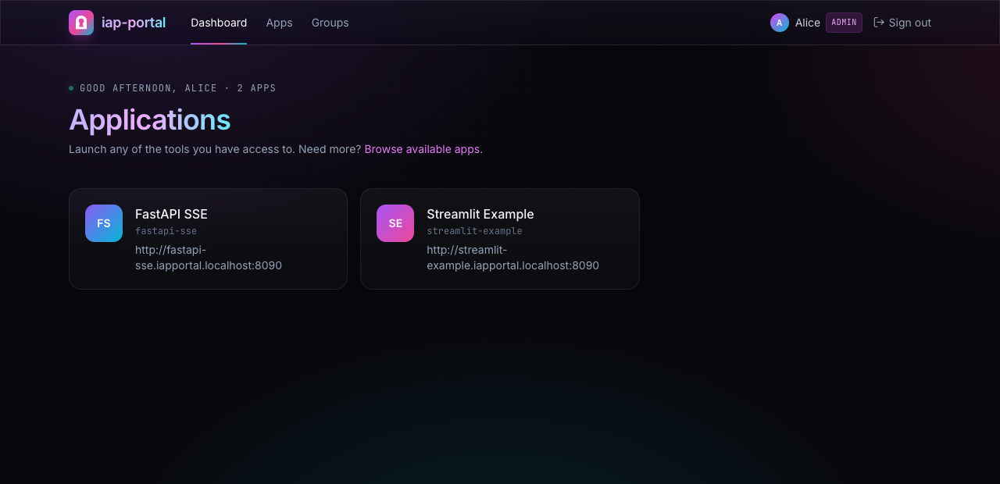

<h4 align="center">
  <picture>
    <source media="(prefers-color-scheme: dark)" srcset="assets/wordmark-dark.svg">
    
  </picture>
  <br>
  One home for your internal apps
</h4>

<p align="center">
  <a href="https://github.com/dylan-murray/iap-portal/actions/workflows/portal-ci.yml"></a>
  <a href="deploy/platform/README.md"></a>
  <a href="LICENSE"></a>
</p>

<h2></h2>

iap-portal gives your team one place to find and use internal apps. Ship a Streamlit
tool, a Gradio demo, a FastAPI service, or a custom web app. The gateway handles
sign-in and app access; owners manage who can use their tools from the portal.



*Local demo with the bundled apps and mock identities.*

## 💡 Why iap-portal

Getting an internal app running is often easier than sharing it. Every new tool
needs a URL, sign-in, access rules, and somewhere for people to find it. iap-portal
provides those pieces once, so each app can use the same deployment and access model.

- **A home for your tools.** A shared app catalog with owner-managed access
  requests, user and group grants, and expiration.
- **Sign-in at the gateway.** Configure Okta, Google, or both. Istio checks access
  before forwarding traffic to an app.
- **Apps as code.** An `iap-app.yaml` file describes the image, route, owners, and
  runtime settings. Deploy with Helm or use the reusable GitHub Actions workflow.
- **Built for interactive apps.** WebSockets and streaming work through the
  gateway. The bundled Streamlit and FastAPI apps exercise both.
- **Your infrastructure.** Use your registry, Postgres, domains, and Kubernetes
  Secrets. No required secrets-management vendor or hosted control plane.
- **Your portal name.** Set `portal.displayName` in Helm values to match your
  company or team, without rebuilding the image.

Kubernetes with Istio is the primary deployment. Docker Compose provides a local
stack with Envoy, Postgres, a mock identity provider, and example apps.

## 🚀 Quick start

From this checkout, install Docker, [uv](https://docs.astral.sh/uv/), Node.js 20+,
and [Task](https://taskfile.dev/installation/), then start the Compose demo:

```bash
task up:full
```

This builds the stack, generates local signing keys, and adds local hostnames
(the hosts-file step requires sudo). Keep it running and register the example
apps from another terminal:

```bash
export IAP_PORTAL_URL=http://portal.iapportal.test:8090
export IAP_PORTAL_TOKEN=dev-admin-token-change-me-in-prod
uv run iap-portal apply examples/streamlit-app/iap-app.yaml
uv run iap-portal apply examples/fastapi-sse/iap-app.yaml
```

Open [the local portal](http://portal.iapportal.test:8090), choose **Continue with
Okta**, and sign in as **alice**. This uses the mock identity provider; no real
OAuth credentials are needed. The example owner is `alice@example.com`.

To try the Kubernetes deployment locally, follow the [Minikube guide](deploy/local/README.md).
For native hot reload and SDK development, see [Local development](docs/LOCAL_DEV.md).

## ☸️ Deploy to Kubernetes

Bring Kubernetes 1.30+, a compatible Istio installation with Gateway API support,
a NetworkPolicy-capable CNI, wildcard DNS/TLS, Postgres, and an Okta or Google OAuth
application. The supplied namespace configuration uses Istio ambient mode.

Generate matching platform manifests and Helm values:

```bash
uv run python scripts/configure-platform.py \
  --domain apps.example.com \
  --image YOUR_REGISTRY/iap-portal \
  --tag 0.1.0 \
  --display-name "Company Apps" \
  --output .internal/company-install

task package:charts
```

Follow [Platform installation](deploy/platform/README.md) to build the portal image,
configure Secrets, apply the Istio and gateway resources, and install the charts.
The generator writes files; it does not modify your cluster.

The `iap-portal` chart installs the portal. The `iap-app` chart deploys each app
with routing, isolation, and registration. Postgres, DNS, certificates, and Istio
are supplied separately. Images and charts currently build from this checkout;
public registry releases are not yet available.

## 🔐 Choose your sign-in providers

Configure either provider or both. Client IDs and issuer settings live in values;
client secrets come from existing Kubernetes Secrets:

```yaml
portal:
  displayName: Company Apps
  auth:
    okta:
      enabled: true
      issuer: https://YOUR_TENANT.okta.com/oauth2/default
      clientId: YOUR_OKTA_CLIENT_ID
      clientSecretRef:
        name: portal-oauth
        key: okta-client-secret
    google:
      enabled: true
      clientId: YOUR_GOOGLE_CLIENT_ID
      clientSecretRef:
        name: portal-oauth
        key: google-client-secret
  allowedEmailDomains: [example.com]
```

Set either provider's `enabled` to `false` to leave it out. Both default to disabled;
production requires at least one. The login page shows only configured providers.
See [provider setup](deploy/platform/README.md#install-the-portal) for redirect URIs,
Secret requirements, and Google Workspace domain restrictions.

## 📦 Ship an app

Install the CLI from this checkout and scaffold a project:

```bash
uv tool install ./sdk
iap-portal init my-tool --framework streamlit --dir my-tool \
  --platform-repo YOUR_ORG/iap-portal
cd my-tool
iap-portal dev
```

Replace `YOUR_ORG/iap-portal` with your platform repository. The scaffold includes
an app, Dockerfile, deployment workflow, and `iap-app.yaml`:

```yaml
slug: my-tool
displayName: My tool
framework: streamlit
entrypoint: app.py
port: 8080
domain: apps.example.com
image:
  repository: YOUR_REGISTRY/my-tool
  tag: "0.1.0"
registration:
  owners: [owner@example.com]
```

Configure your registry and deployment credentials, prepare the app namespace,
and deploy with Helm or GitHub Actions. The registration Job uses a projected
ServiceAccount token; app namespaces do not need the portal's admin credential.
See [Adding an app](docs/ADDING_AN_APP.md) for the complete walkthrough.

## ⚙️ How it works

```text
Browser → Istio gateway → application
               │              ↑
               │ access check │ app-scoped identity
               ↓              │
          IAP Portal ─────────┘
          sign-in · grants · app catalog
               │
            Postgres
```

The gateway asks the portal whether the user may access the app. Each app gets
its own session cookie and app-scoped token; it never receives the portal session.
The optional Python SDK verifies the signed token and exposes a typed user object.
Apps remain responsible for permissions inside their own application.

This is an early project. Read [Security](docs/SECURITY.md) for the trust model,
implemented controls, and remaining validation gaps before deploying it for a team.

## 📚 Go further

- [Platform installation](deploy/platform/README.md) — Helm, Istio, domains, providers, and Secrets.
- [Minikube](deploy/local/README.md) — the Kubernetes stack with mock authentication.
- [Local development](docs/LOCAL_DEV.md) — Compose, hot reload, and SDK development.
- [Adding an app](docs/ADDING_AN_APP.md) — scaffolding, images, registration, and deployment.
- [Security](docs/SECURITY.md) — identity boundaries, access enforcement, and limitations.
- [Upgrading](docs/UPGRADING.md) — database migrations and deployment changes.

## ❓ FAQ

**Is this an identity provider?** No. Okta or Google authenticates the user.
iap-portal handles app discovery and app-level access, with Istio enforcing the
access decision at the gateway.

**Do I have to use Python?** No. Custom web apps can sit behind the gateway.
The Python SDK and framework images are conveniences for Python applications.

**Does it work without Kubernetes?** The repository includes a Docker Compose
stack for local development. Kubernetes with Istio is the primary deployment;
Compose is not currently documented as a production installation.

**Where does the data live?** In the Postgres database you configure. It can run
inside or outside the cluster. The portal chart does not provision it. The
Minikube demo database is disposable and has no persistent volume.

**Can I use it commercially?** Yes. The core is licensed under Apache 2.0, with
no per-seat limit.

## 🤝 Contributing

See [CONTRIBUTING.md](CONTRIBUTING.md) for setup and contribution guidelines.
Run `task test` for the backend, SDK, and chart tests; `task check:portability`
checks distributable source, Helm charts, and Compose configuration.

## 📄 License

iap-portal is licensed under the [Apache License 2.0](LICENSE).
